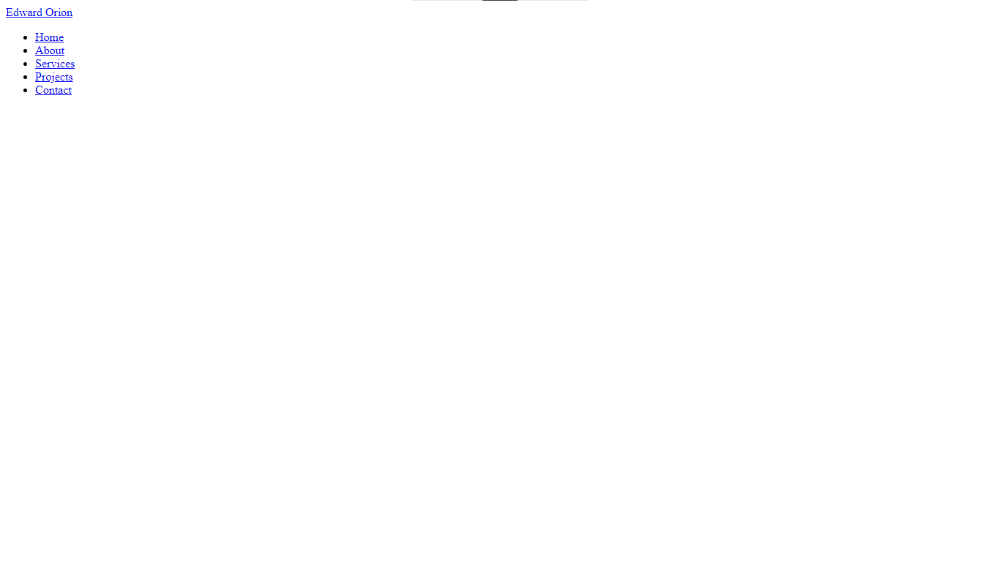
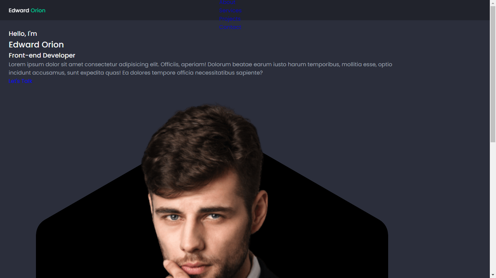

# GETTING STARTED WITH HTML5 AND CSS3

**LEARNING OUTLINE**
* Membuat Website dengan HTML dan CSS
* Membuat Responsive Website dengan Media Query
---
### APA ITU HTML?
> HTML adalah sebuah bahasa singkatan dari HyperText Markup Language dan ini adalah bahasa markah standar untuk peramban internet.

### APA ITU CSS?
> CSS sendiri adalah singkatan dari Cascading Style Sheets, ini adalah sebuah komponen untuk membuat website kita lebih terstruktur dan seragam.
---

Pada praktek kali ini kita akan membuat sebuah website portofolio dimana website tersebut akan kita buat menggunakan HTML dan CSS.


1. Langkah pertama adalah membuat folder di PC/Laptop kalian dengan nama **Responsive-Portofolio**.
2. Buka VSCode lalu klik File > Open Folder > pilih folder kalian.
3. Tambahkan sebuah file dengan nama **index.html**.

Didalam file index.html ketik ! dan tekan Tab pada keyboard maka akan terbuat sebuah syntax HTML seperti ini :
```html
<!DOCTYPE html>
<html lang="en">
<head>
    <meta charset="UTF-8">
    <meta name="viewport" content="width=device-width, initial-scale=1.0">
    <title>Document</title>
</head>
<body>
    
</body>
</html>
```
## Lalu kita akan membuat Header dan Navbar terlebih dahulu
```html
    <!-- HEADER -->
    <header class="header" id="header">
      <nav class="nav container">
        <a href="#" class="nav__logo"> Edward <span>Orion</span> </a>

        <div class="nav__menu" id="nav-menu">
          <ul class="nav__list">
            <li class="nav__item">
              <a href="#home" class="nav__link active-link">Home</a>
            </li>

            <li class="nav__item">
              <a href="#about" class="nav__link">About</a>
            </li>

            <li class="nav__item">
              <a href="#services" class="nav__link">Services</a>
            </li>

            <li class="nav__item">
              <a href="#projects" class="nav__link">Projects</a>
            </li>

            <li class="nav__item">
              <a href="#contact" class="nav__link">Contact</a>
            </li>
          </ul>

          <!-- Close button -->
          <div class="nav__close" id="nav-close">
            <i class="ri-close-line"></i>
          </div>
        </div>

        <!-- Toggle button -->
        <div class="nav__toggle" id="nav-toggle">
          <i class="ri-menu-line"></i>
        </div>
      </nav>
    </header>
```
Maka hasilnya akan seperti ini :


Buatlah sebuah elemen **main** yang didalamnya ada elemen **section** dan **div**
```html
<main class="main">
      <!-- Section Home -->
      <section class="home section" id="home">
        <div class="home__container container grid">
          <div class="home__content">
            <div class="home__data">
              <h3 class="home__subtitle">Hello, <span>I'm</span></h3>

              <h1 class="home__title">Edward <span>Orion</span></h1>

              <h3 class="home__education">Front-end Developer</h3>

              <p class="home__description">
                Lorem ipsum dolor sit amet consectetur adipisicing elit. Officiis, aperiam! Dolorum beatae earum iusto harum temporibus, mollitia esse, optio incidunt accusamus, sunt expedita quas! Ea dolores tempore officia necessitatibus
                sapiente?
              </p>

              <a href="#contact" class="button">Let's Talk</a>
            </div>

            <div class="home__social">
              <a href="https://github.com/Vinnn553" target="_blank" class="home__social-link">
                <i class="ri-github-fill"></i>
              </a>

              <a href="" target="_blank" class="home__social-link">
                <i class="ri-instagram-fill"></i>
              </a>

              <a href="" target="_blank" class="home__social-link">
                <i class="ri-linkedin-fill"></i>
              </a>
            </div>
          </div>

          <div class="home__image">
            <svg class="home__blob" viewBox="0 0 550 591" xmlns="http://www.w3.org/2000/svg">
              <mask id="maskBlob" mask-type="alpha">
                <path
                  d="M263 47.1782C270.426 42.891 279.574 42.891 287 47.1782L501.157 
                 170.822C508.583 175.109 513.157 183.032 513.157 191.606V438.894C513.157 
                 447.468 508.583 455.391 501.157 459.678L287 583.322C279.574 587.609 270.426 
                 587.609 263 583.322L48.843 459.678C41.4174 455.391 36.843 447.468 36.843 
                 438.894V191.606C36.843 183.032 41.4174 175.109 48.843 170.822L263 47.1782Z"
                />
              </mask>
              <g mask="url(#maskBlob)">
                <path
                  d="M263 47.1782C270.426 42.891 279.574 42.891 287 47.1782L501.157 
                 170.822C508.583 175.109 513.157 183.032 513.157 191.606V438.894C513.157 
                 447.468 508.583 455.391 501.157 459.678L287 583.322C279.574 587.609 270.426 
                 587.609 263 583.322L48.843 459.678C41.4174 455.391 36.843 447.468 36.843 
                 438.894V191.606C36.843 183.032 41.4174 175.109 48.843 170.822L263 47.1782Z"
                />

                <rect x="37" width="476" height="630" fill="url(#pattern0)" />
              </g>

              <rect x="37" width="476" height="300" fill="url(#pattern1)" />

              <defs>
                <pattern id="pattern0" patternContentUnits="objectBoundingBox" width="1" height="1">
                  <use href="#imageBlob" transform="matrix(0.00143057 0 0 0.00108108 0.0404062 0)" />
                </pattern>

                <pattern id="pattern1" patternContentUnits="objectBoundingBox" width="1" height="1">
                  <use href="#imageBlob" transform="matrix(0.00143057 0 0 0.00226984 0.0404062 0)" />
                </pattern>

                <!-- Insert your profile (recommended size: 640 x 940) -->
                <image class="home__img" id="imageBlob" width="640" height="925" href="img/perfil.png" />
              </defs>
            </svg>
          </div>
        </div>
      </section>
    </main>
```
Jika sudah lalu kita ke file styles.css dan kita buat agar website kita menjadi lebih rapih dan terstruktur.

Pertama kalian bisa copy kode berikut ini :
```css
:root {
  --header-height: 3.5rem;

  --hue: 162;
  --first-color: hsl(var(--hue), 100%, 40%);
  --first-color-alt: hsl(var(--hue), 56%, 35%);
  --title-color: hsl(228, 8%, 95%);
  --text-color: hsl(228, 8%, 65%);
  --body-color: hsl(228, 15%, 20%);
  --container-color: hsl(228, 15%, 15%);

  --body-font: "Poppins", sans-serif;
  --biggest-font-size: 2rem;
  --bigger-font-size: 1.25rem;
  --h1-font-size: 1.5rem;
  --h2-font-size: 1.25rem;
  --h3-font-size: 1rem;
  --normal-font-size: 0.938rem;
  --small-font-size: 0.813rem;
  --smaller-font-size: 0.75rem;

  --font-regular: 400;
  --font-medium: 500;
  --font-semi-bold: 600;

  --z-tooltip: 10;
  --z-fixed: 100;
}
```
Lalu kita buat sebuah Base didalam file CSS seperti berikut :
```css
/* Base */
* {
  box-sizing: border-box;
  padding: 0;
  margin: 0;
}

html {
  scroll-behavior: smooth;
}

input,
textarea,
button,
body {
  font-family: var(--body-font);
  font-size: var(--normal-font-size);
}

body {
  background-color: var(--body-color);
  color: var(--text-color);
}

input,
textareaa,
button {
  outline: none;
  border: none;
}

h1,
h2,
h3,
h4 {
  color: var(--title-color);
  font-weight: var(--font-medium);
}

ul {
  list-style: none;
}

a {
  text-decoration: none;
}

img,
svg {
  max-width: 100%;
  height: auto;
}
```
Sekarang kita hubungkan file HTML dengan CSS-nya dengan menggunakan syntax berikut ini :
Taruh diatas element <title>
```html
<link rel="stylesheet" href="./assets/css/styles.css" />
```
Sekarang file HTML dan CSS sudah terhubung, lalu kita kembali lagi kedalam file CSS. Sekarang kita atur setiap elemen yang ada agar rapih dan terstruktur.
```css
/* Reusable CSS Classes */
.container {
  max-width: 1120px;
  margin-inline: 1.5rem;
}

.grid {
  display: grid;
  gap: 1.5rem;
}

.section {
  padding-block: 5rem 2rem;
}

.section__title,
.section_subtitle {
  text-align: center;
  color: var(--title-color);
  font-weight: var(--font-semi-bold);
}

.section__title {
  font-size: var(--h1-font-size);
  margin-bottom: 1.5rem;
}

.section_subtitle {
  font-size: var(--small-font-size);
  margin-bottom: 0.25rem;
}

.section_subtitle span {
  color: var(--first-color);
}

.main {
  overflow: hidden;
}

.header {
  position: fixed;
  width: 100%;
  background-color: var(--container-color);
  top: 0;
  left: 0;
  z-index: var(--z-fixed);
}

.nav {
  height: var(--header-height);
  display: flex;
  justify-content: space-between;
  align-items: center;
}

.nav__logo {
  color: var(--title-color);
  font-weight: var(--font-medium);
}

.nav__logo span {
  color: var(--first-color);
}

.nav__toggle,
.nav__close {
  display: flex;
  font-size: 1.25rem;
  color: var(--title-color);
  cursor: pointer;
}
```
Maka hasilnya akan menjadi seperti berikut :

Tidak perlu khawatir dengan teks yang berantakan karena akan kita atur di file CSS.

Sekarang tekan F12 dikeyboard kalian karena kita akan membuat sebuah kode responsive difile CSS.
