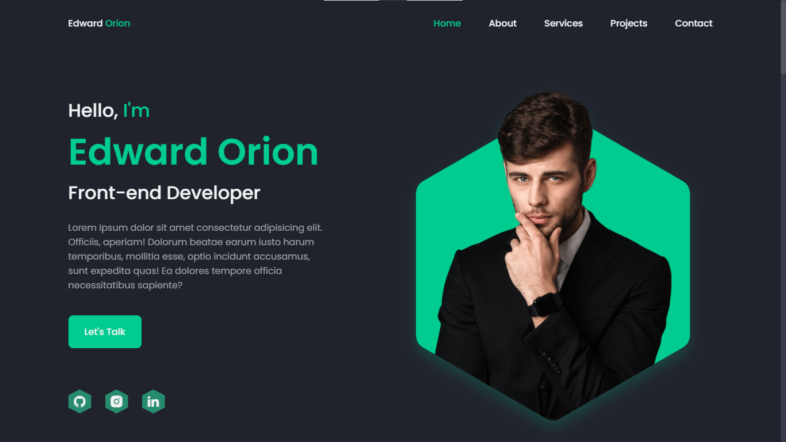

# GETTING STARTED WITH HTML5 AND CSS3

**LEARNING OUTLINE**
* Membuat Website dengan HTML dan CSS
* Membuat Responsive Website dengan Media Query
---
### APA ITU HTML?
> HTML adalah sebuah bahasa singkatan dari HyperText Markup Language dan ini adalah bahasa markah standar untuk peramban internet.

### APA ITU CSS?
> CSS sendiri adalah singkatan dari Cascading Style Sheets, ini adalah sebuah komponen untuk membuat website kita lebih terstruktur dan seragam.
---

Pada praktek kali ini kita akan membuat sebuah website portofolio dimana website tersebut akan kita buat menggunakan HTML dan CSS.



1. Langkah pertama adalah membuat folder di PC/Laptop kalian dengan nama **Responsive-Portofolio**.
2. Buka VSCode lalu klik File > Open Folder > pilih folder kalian.
3. Tambahkan sebuah file dengan nama **index.html**.

Didalam file index.html ketik ! dan tekan Tab pada keyboard maka akan terbuat sebuah syntax HTML seperti ini :
```html
<!DOCTYPE html>
<html lang="en">
<head>
    <meta charset="UTF-8">
    <meta name="viewport" content="width=device-width, initial-scale=1.0">
    <title>Document</title>
</head>
<body>
    
</body>
</html>
```
Lalu kita akan membuat Header dan Navbar terlebih dahulu
```html
    <!-- HEADER -->
    <header class="header" id="header">
      <nav class="nav container">
        <a href="#" class="nav__logo"> Edward <span>Orion</span> </a>

        <div class="nav__menu" id="nav-menu">
          <ul class="nav__list">
            <li class="nav__item">
              <a href="#home" class="nav__link active-link">Home</a>
            </li>

            <li class="nav__item">
              <a href="#about" class="nav__link">About</a>
            </li>

            <li class="nav__item">
              <a href="#services" class="nav__link">Services</a>
            </li>

            <li class="nav__item">
              <a href="#projects" class="nav__link">Projects</a>
            </li>

            <li class="nav__item">
              <a href="#contact" class="nav__link">Contact</a>
            </li>
          </ul>

          <!-- Close button -->
          <div class="nav__close" id="nav-close">
            <i class="ri-close-line"></i>
          </div>
        </div>

        <!-- Toggle button -->
        <div class="nav__toggle" id="nav-toggle">
          <i class="ri-menu-line"></i>
        </div>
      </nav>
    </header>
```
